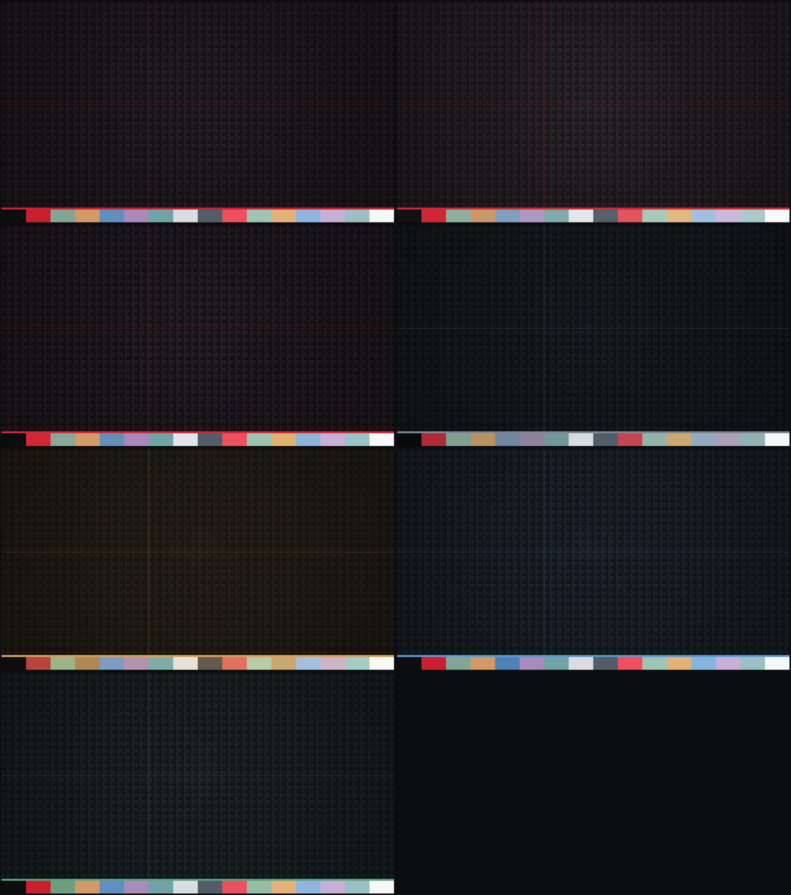

# X1 theme family for Omarchy

Seven dark ThinkPad-inspired variants — a mono-graphite base plus one accent
per variant — generated from a single source of truth. Targets **Omarchy 4
"quattro"** (omarchy-shell + Hyprland Lua config).



## Install (any Omarchy 4 machine)

```bash
git clone https://github.com/bartekj/x1-omarchy-themes.git
cd x1-omarchy-themes
./build.sh     # needs ImageMagick + JetBrainsMono Nerd Font (both stock on Omarchy)
./install.sh   # copies all seven variants into ~/.config/omarchy/themes/
omarchy theme set x1-azure   # or x1 / x1-graphite / x1-redline / x1-stealth / x1-ember / x1-moss
```

This is a seven-theme family plus bar plugins, so it deliberately does not
follow the `omarchy-<name>-theme` one-repo-one-theme convention — `omarchy
theme install` would land it as a single broken theme. The script route also
keeps every theme at full fidelity: a theme installed as a git clone has its
`hyprland.lua`, `neovim.lua`, and `vscode.json` dropped and regenerated by
Omarchy, which would lose the solid-border geometry and per-variant editor
themes. Bar switcher widgets (`x1-theme-status`/`-next`) are optional — they
need the `shell.json` entries described in "Bar cockpit" below.


| Variant | Character | Accent |
| --- | --- | --- |
| `x1` | Matte graphite, TrackPoint-red accents | `#c82031` |
| `x1-graphite` | Daylight X1, brighter surfaces, TrackPoint-red accents | `#ce2835` |
| `x1-redline` | TrackPoint-forward, clearer red | `#d12736` |
| `x1-stealth` | Near-black, neutral accents | `#7d8792` |
| `x1-ember` | Warm graphite, keyboard-backlight amber | `#d9a05b` |
| `x1-azure` | Matte graphite, ThinkVantage steel-blue accents | `#5e9ad4` |
| `x1-moss` | Matte graphite, subdued power-LED green accents | `#58a877` |

## Layout

```
palettes/<variant>.toml   single source of truth (~30 tokens per variant)
templates/*.tpl           14 shared templates, Omarchy {{ key }} syntax:
  colors.toml               semantic palette (quattro schema) + solid border tokens
  hyprland.lua              solid full-alpha borders (border_part_of_window
                            =false), gaps, rounding, shadow (range = gaps_out),
                            window blur with xray (kills wallpaper bloom),
                            blur layer_rules for shell popups (no xray),
                            one glass via default-opacity rule (0.97/0.94,
                            fullscreen 1.0, browsers pinned opaque),
                            group/nogroup border colors
  shell.{bar,launcher,menu,notifications,lock,controls,popups,tooltip}.toml
                            omarchy-shell section overrides (glass + border
                            system; see "Border system" below)
  icons.theme / neovim.lua / vscode.json / README.md
tools/contrast-audit      WCAG contrast audit of every palette (gates nothing,
                          run it when touching colors; exits non-zero on fail)
assets/source/BG1.png     shared original wallpaper (tinted per variant)
build/                    output (gitignored)
```

## Usage

```bash
./build.sh     # render templates + generate wallpapers/previews into build/
./install.sh   # copy build/* into ~/.config/omarchy/themes/ (+ refresh if active)
omarchy theme set x1-stealth   # or x1 / x1-redline / x1-graphite / x1-ember / x1-azure / x1-moss
```

Never edit `~/.config/omarchy/themes/x1*` by hand — edit a palette (or a
template) here and rebuild. `omarchy-theme-refresh` is the fast dev loop
(install.sh runs it automatically when an x1 variant is active).

## Theme-picker previews

`preview.png` must be an **8-bit** PNG: on the first picker open after a
rebuild, the lazy-thumbnail path hands Qt the original file, and a 16-bit
(Q16 magick default) PNG renders as a blank card — no placeholder, no
retry. build.sh renders 1600x900 (the thumbnailer crops to 1536x864, 16:9)
with `-depth 8`, and install.sh warms the thumbnail cache via
`omarchy-theme-switcher --preload` so the first open never hits the lazy
path.

## Signature wallpapers

Every variant ships the same curated ten-piece set, tinted 8% with the
variant accent so the identity carries without shouting:

1. `01-hessian.jpg` — open coarse hessian grid, deep gaps.
2. `02-canvas.jpg` — tight uniform canvas weave.
3. `03-sackcloth.jpg` — heavy sackcloth, raking side light.
4. `04-fiber.jpg` — dense matted fiber, non-woven felt.
5. `05-weave.jpg` — tight woven fabric, the technical texture.
6. `06-jute.jpg` — heavy jute drape, warm folds.
7. `07-sand.jpg` — fine granular grain, near-monochrome.
8. `08-poplin.jpg` — fine crisp weave, cool grey.
9. `09-lattice.jpg` — open lattice weave, muted violet.
10. `10-knit.jpg` — dark cable knit, interlocked loops.

When `assets/backgrounds/` is empty, `build.sh` falls back to a fully
procedural set (accent-fiber carbon weave, a knurled TrackPoint dot, and the
tinted heritage photo) — see `generate_weave` / `generate_trackpoint` /
`generate_heritage` in build.sh. The unlock glyph keeps its accent ring in
both cases.

## Custom wallpapers

Two routes:

- **Route A (no rebuild):** drop images into
  `~/.config/omarchy/backgrounds/<variant>/` — Omarchy cycles them natively,
  sorted before the theme's own backgrounds.
- **Route B (versioned):** drop images into `assets/backgrounds/<variant>/`
  (or `assets/backgrounds/all/` for every variant). `./build.sh` then ships
  them **instead of** the signature set.

## Token contract (Omarchy 4)

- `colors.toml` uses quattro's **semantic schema** (`mode`, `accent`,
  `selection`, `muted`, `background`, `lighter_background`, `foreground`,
  `dark_foreground`, ..., `red`..`cyan`, `bright_*`). The palette's legacy
  ANSI ramp maps onto it so `omarchy-theme-color` derives `color0..15`
  **exactly** — one known exception: the resolver force-binds terminal
  `cursor` to `bright_foreground`.
- Two custom keys carry the border identity into Omarchy's own templates
  (`hyprland.lua.tpl` and every shell surface border):
  `hyprland_active_border` = a solid `accent` at full alpha (`ff`);
  `hyprland_inactive_border` = a solid `window_border_inactive` (warm
  graphite, one per variant) at full alpha. Window borders and popup
  borders are now the exact same line.
- Everything not shipped by the theme (alacritty, kitty, ghostty, foot, btop,
  helix, chromium, keyboard.rgb, ...) is generated by Omarchy from the
  semantic palette — deliberately, so upstream template improvements land
  automatically.
- The shell glass identity lives in `shell.<section>.toml` overrides:
  `bar_alpha` / `pill_alpha` / `pill_border_alpha` from the palette; corner
  radius is NOT a shell key — the shell reads `hyprctl decoration:rounding`,
  so one shared geometry (rounding 5, gaps 4/8, border 2px) ships once, in
  `hyprland.lua`, the same in every variant.
- Conventions enforced by the templates:
  - `accent` never means error; alerts use `critical` (== `color9`).
    ANSI `color1`/`color9` stay semantically red in every variant.
  - `border` = hairlines; `border_soft` = card borders (notifications,
    launcher, menu); `window_border_inactive` = the solid warm-graphite line
    for unfocused windows/groups (own token, distinct from both).
  - `color8` doubles as the terminal dim gray, selection background, and
    border base — it must hold ≥ 2.8:1 on `background` (see
    `tools/contrast-audit`). The shell `muted` semantic maps to the
    palette's brighter `muted` (~7:1), not to `color8`.
  - No font or size keys in any shell override — `omarchy-display-text-size`
    and the stock `[font]`/`[spacing]` sections stay in charge (see
    "Readability knobs" below).

## Border system

Four layers, one solid line (`accent` at full alpha, from
`hyprland_active_border`; `window_border_inactive` at full alpha, from
`hyprland_inactive_border`):

1. **Windows** — a solid `accent` line at 2px, via `hyprland.lua`, with
   `decoration.border_part_of_window = false` so the line always renders at
   its true full-alpha color regardless of window opacity (no more borders
   diluted by the glass they frame). Inactive windows and groups get the
   solid `window_border_inactive` line instead. Omarchy's stock `shell.toml`
   generation exposes the active color as the shared
   `[hyprland] active-border` token.
2. **Popups, tooltips, lock, polkit** — every bar flyout (dropdowns, OSD,
   detail panels) gets the same glass as the quiet cards (`surface` at
   `pill_alpha`, tooltip at 0.92) and echoes the window border via
   `hyprland.active-border` / `...-foreground` — window borders and popup
   borders are the exact same line now.
3. **Quiet cards** (launcher, menu, notifications) — hairline `border_soft`
   at `pill_border_alpha`; the *selected* row echoes the window border
   (`selected-border = "hyprland.active-border"` @ 0.35) instead of a solid
   accent, tying selection to the window identity.
4. **Controls** (`shell.controls.toml`) — a three-step border story for
   buttons/dropdowns/toggles: idle = `border_soft` hairline @ 0.5,
   interaction (hover/focus) = `accent_dim` @ 0.4/0.45, committed
   (selected) = `accent` @ 0.45. Fill alphas stay near shell defaults.

### Card frames

`bart.media` opts out of layer 4 entirely, defaulting to `frameStyle = "none"`
— no container at all. Three frame styles are available in `shell.json` via
`frameStyle`.

| Style | What it is |
|---|---|
| `none` (default) | Nothing at all |
| `bloom` | No frame at all — a halo behind the card, coloured by load |
| `flat` | The original hairline-bordered rectangle |

`bloom` is QML rather than shader: its halo spills outside the item's bounds
and takes its colour from live data, neither of which fits a shader clipped
to the item. `bart.media` has no load to report, so it gets a steady halo in
the bar foreground. (`bart.resources` — see "Bar cockpit" below — uses this
same style set from its own diverging copy of `CardFrame.qml`, and drives the
halo's colour from its per-resource load; cell dividers and per-cell readout
styles, `columns`/`meter`/`text`, are that plugin's design now and documented
in its own README, not here.)

- **`bar/shared/` holds only `CardFrame.qml` now.** Quickshell plugins cannot
  import each other, so `tools/build-plugin-shared` copies it into
  `bar/plugins/bart.media`; never edit that copy by hand, the next run
  overwrites it. `bart.resources` moved to its own plugin repo
  (`~/Projects/omarchy-plugin-resources`) and carries a diverging copy of
  `CardFrame.qml`, ported by hand — it is no longer fanned out from here.
- **The bloom halo is a blurred outline, not a blurred fill.** Blurring a
  filled rect leaves the middle fully coloured, which fogs the readout
  instead of haloing it.
- **Unknown or stale `frameStyle` values** — left over from an older
  shell.json, from before the shader styles were pruned — fall back to
  `none` rather than erroring.

## Readability knobs (don't fight them)

- `omarchy display text size <9-20>` — one knob for shell font, GTK text
  scaling, and terminal pt size. The themes ship no font keys, so it always
  wins.
- Monitor scale is managed dynamically (Omarchy display settings /
  `SUPER+/` / `SUPER+ALT+/`), not pinned by the themes.
- System tray: icons are always-visible only when **pinned** — the tray entry
  in `~/.config/omarchy/shell.json` holds `"pinned": [...]` / `"hidden": [...]`
  per StatusNotifierItem id; new apps land in the auto-hiding drawer until
  pinned via the tray's manage popup.

## Bar cockpit (Omarchy 4 shell)

`bart.resources` — the CPU / RAM / temp / disk cluster — has moved out to its
own plugin repo, `~/Projects/omarchy-plugin-resources`; it is no longer
shipped by this repo or touched by its `install.sh`. It's installed live via
`omarchy plugin add` (a git clone at
`~/.config/omarchy/plugins/bart.resources/`, shell.json entry
`{"id": "bart.resources"}`). The cluster is collapsible — a click shrinks it
to a single ~27px icon and back — and keeps the per-resource detail panels,
thresholds, and EMA-smoothed temperature this repo originally prototyped.
See that repo's own README for the full settings/IPC/threshold reference.

Bar transparency: filled graphite glass — `bar_alpha` 0.50, uniform across
all seven variants — is the intended default, so the bar carries visible
weight instead of imperceptibly tinting the wallpaper. Double-clicking empty
center bar space toggles the shell's native `"transparent": true` mode (no
fill at all, wallpaper-contrast text); the toggle persists into the user's
shell.json.

`bar/scripts/x1-theme-{status,next}` drive the bar theme switcher
(`{"type": "command"}` module: click = next variant in the cycle
x1 -> stealth -> redline -> graphite -> ember -> azure -> moss, right-click =
`omarchy-menu summon style.theme`). The shell.json entries live in
`~/.config/omarchy/shell.json` (user config, NOT installed by install.sh).

`bar/plugins/bart.media/` is the now-playing widget: the stock media row
wrapped in the same framed card, prefixed with a **per-source Nerd Font
glyph** (`SourceIcons.js` — Spotify/Chrome/Firefox/mpv/…, music note as
fallback). It is widget-only **by design**: cloning `omarchy.media` would
also clone its `service` kind, which disables the first-party service and
breaks both this widget and the audio panel's media section. Two fixes over
stock: the scroll animation resets `x` when it stops (a value source, not a
binding — it used to freeze off-clip, leaving an invisible label in a slot
that still reserved width, which is why now-playing seemed to vanish), and
`maxLabelWidth` moved to a scaled token. Note YouTube-in-a-browser shows the
browser glyph: Chromium exposes one MPRIS interface for all tabs and emits no
`xesam:url`, so the site is genuinely not identifiable.

`bar/plugins/bart.weather/` is a patched clone of the built-in weather
plugin (`omarchy plugin clone omarchy.weather`) that shows
`icon + temperature` on the bar; the popup (3-day forecast, location
picker) is untouched. The exact patch is `bar/plugins/weather-barwidget.diff`.
**After an Omarchy upgrade changes the stock weather plugin:** delete the
clone, re-clone, re-apply the diff, rsync back into the repo. Emergency
rollback: `omarchy plugin disable bart.weather` restores the built-in.

Cockpit gotchas:
- Command modules re-exec ONLY on their interval — no click-refresh, no
  signals. Plain-text output is trimmed; fixed width requires JSON with
  padding inside `"text"`.
- The only styling class is `"active"` (theme urgent color) — no
  warning/critical tiers.
- Editing (or `omarchy plugin update`-ing) the QML of an already-loaded
  plugin hot-reloads the registry but not the code: the shell reuses the
  bar-widget component it already mounted for that URL, and
  `Qt.clearComponentCache()` cannot evict a type an instance still
  references. Hot-reload only picks up brand-new plugins and manifest-only
  metadata — an already-loaded widget's QML needs `omarchy-restart-shell` to
  actually take effect, `plugin add`/`plugin update` included. (This is what
  bit `bart.resources` after it moved to its own git-managed plugin repo.)
  `omarchy-refresh-shell` is a config RESET, not a reload — it overwrites
  shell.json with the default.

## Gotchas learned the hard way

- Never ship a full `shell.toml` in a theme: the never-overwrite rule in
  `omarchy-theme-set-templates` would freeze generation, and the
  `shell.<section>.toml` splicer needs the generated file to exist. Ship
  per-section overrides only.
- A `shell.<section>.toml` override replaces the whole section, but omitted
  keys fall back to the shell's built-in `Style.qml` defaults — partial
  sections are safe.
- `shell.*.toml` files are NOT template-processed by Omarchy — they must be
  rendered to literal values at build time (build.sh does this).
- `omarchy-theme-set-vscode` strips `workbench.colorTheme` when a theme has
  no `vscode.json`; `"extension": ""` cleanly selects a built-in VS Code theme.
- Themes without `neovim.lua` leave `~/.config/nvim/lua/plugins/theme.lua`
  dangling. Each variant renders its exact 16 colors via RRethy/base16-nvim.
